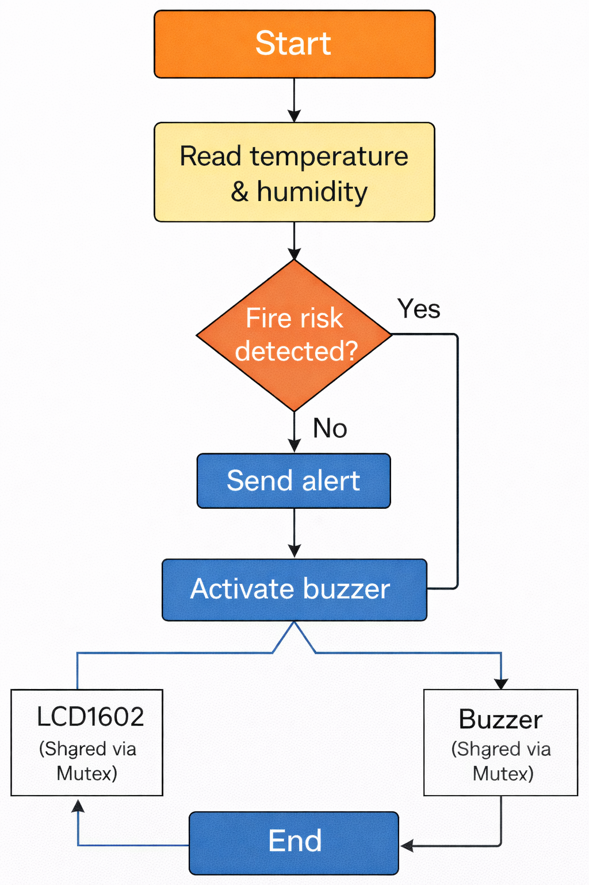

# esp32c3-fire-gas-detection
# Smart Fire & Gas Detection System Using ESP32-C3 (FreeRTOS Project)

This project implements a **real-time IoT fire and gas hazard detection system** using the ESP32-C3 and FreeRTOS.  
The system detects flammable gases and hazardous air quality using **MQ-2** and **MQ-135** sensors, displays real-time results on an **OLED**, and activates an **alarm system** when danger is detected.

---

## 🔥 System Features

- Real-time gas (MQ-2) & air-quality (MQ-135) monitoring  
- OLED display for live sensor readings  
- Interrupt-based hazard spike detection  
- Event Groups for multi-hazard signaling  
- Message Buffers for task-to-task communication  
- Mutex to protect OLED + buzzer  
- Buzzer + LEDs as alarm indicators  
- FreeRTOS multi-tasking architecture  
- Cloud-ready structure for future RainMaker integration

---

# 🧩 System Architecture

---

# 🛠 Hardware Components

| Component | Description |
|----------|-------------|
| ESP32-C3 | Main MCU running FreeRTOS |
| MQ-2 Sensor | Detects LPG, methane, smoke |
| MQ-135 Sensor | Detects CO₂, NH₃, CO, alcohol vapors |
| OLED (SSD1306) | Displays system readings |
| Buzzer | Audible alarm |
| LEDs | Visual alarm indicators |
| Pushbutton Interrupts | Simulate hazard spikes |

---

# 🔌 GPIO Mapping

| Device | GPIO |
|--------|------|
| MQ-2 DO | GPIO 6 |
| MQ-135 DO | GPIO 7 |
| Buzzer | GPIO 5 |
| LED Red | GPIO 3 |
| LED Green | GPIO 4 |
| LED Yellow | GPIO 2 |
| OLED SDA | GPIO 9 |
| OLED SCL | GPIO 10 |

---

# 🧵 FreeRTOS Task Overview

### **Task 1 — Sensor Task**
- Reads MQ-2 & MQ-135 digital outputs  
- Packages into `SensorMsg_t`  
- Sends to message buffer  

### **Task 2 — Monitor Task**
- Pulls sensor data from message buffer  
- Interprets hazard conditions  
- Sets event group flags  
- Notifies Emergency Task  

### **Task 3 — Emergency Task**
- Responds to hazards  
- Displays warnings on OLED  
- Activates buzzer + LEDs  
- Clears flags  

### **Task 4 — Display Task**
- Shows real-time sensor status  
- Uses mutex for OLED  

### **Task 5 — Cloud Task (Optional)**
- Placeholder for ESP RainMaker cloud sync  
- OTA update integration point  

---

# ⚡ Interrupt Handling Flow

- Button ISR creates out-of-range hazard values  
- ISR sets event bits  
- ISR notifies Emergency Task  
- Emergency Task processes hazards immediately  

---

# ⚠ Hazard Detection Logic

---

# 📂 Source Code
/src
app_main.c
tasks_common.h
sensor_task.c
monitor_task.c
emergency_task.c
display_task.c
cloud_task.c
oled_driver.c

---

# 🖥 Live OLED Output Examples

MQ2: OK
MQ135: OK

MQ-2 GAS ALERT!
MQ-135 AIR HAZARD!

---

# 🔊 Buzzer Logic

- 3× alarm beeps on hazard  
- Fast blink (LED red)  
- Event flags cleared after handling  

---

# 🌐 GitHub Pages Report Link

(https://github.com/faizaydil/esp32c3-fire-gas-detection/)

---

# 📘 License

This project is created for academic use.
The firmware source code is stored in:

