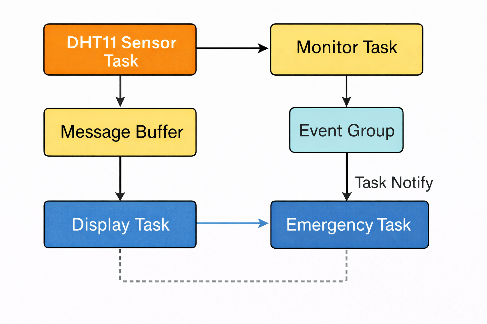
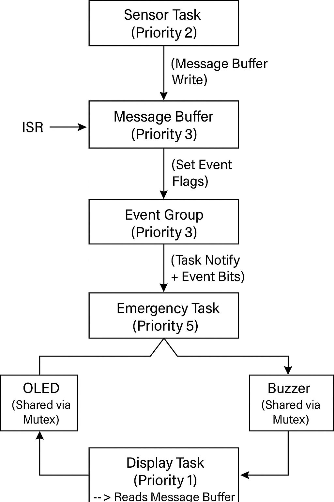
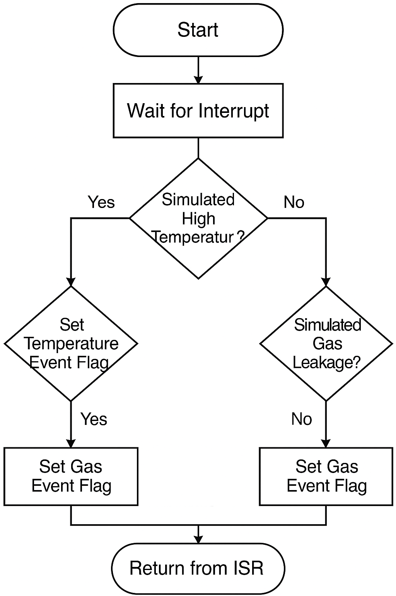

# 🔥 Smart Fire Risk Detection System Using ESP32-C3 and FreeRTOS (DHT11-Based)

This project implements a **real-time fire risk detection system** using the **Seeed Studio XIAO ESP32-C3** and **FreeRTOS**.  
Instead of gas sensors, the system detects **fire-prone conditions** by monitoring **temperature and humidity** using a **DHT11 sensor**.

Fire risk is identified when **high temperature** occurs, which is a common early indicator of fire hazards in embedded and smart monitoring systems.

---

## System Features

- FreeRTOS multi-tasking architecture  
- Temperature & humidity monitoring (DHT11 – simulated)  
- Fire risk detection using **Event Groups**  
- Inter-task communication via **Message Buffers**  
- Mutex-protected **LCD1602 (I²C)** display  
- Audible alert using a **buzzer**  
- Visual system indication using **LEDs**  
- Designed using **ESP-IDF v5.5**

---

## System Architecture

---

## Hardware Components

- Seeed Studio XIAO ESP32-C3  
- DHT11 Temperature & Humidity Sensor  
- LCD1602 with I²C Backpack (PCF8574)  
- Active buzzer  
- Red, Yellow, and Green LEDs  
- Breadboard and jumper wires  

---

## GPIO Mapping

| Device | GPIO |
|------|------|
| DHT11 DATA | GPIO 4 |
| LCD SDA | GPIO 9 |
| LCD SCL | GPIO 10 |
| Buzzer | GPIO 8 |
| Red LED (Fire Alert) | GPIO 5 |
| Yellow LED (Monitoring) | GPIO 6 |
| Green LED (Normal State) | GPIO 7 |

---

## Fire Risk Detection Logic

Fire risk is detected when:
- **Temperature > 40°C**

When the condition is met:
- Red LED turns ON  
- Buzzer is activated  
- LCD displays **“!! FIRE RISK !!”**

When the system is in a normal state:
- Green LED remains ON  
- LCD displays **“Status: NORMAL”**

---

## FreeRTOS Task Overview

### **Task 1 — DHT11 Sensor Task**
- Periodically generates temperature and humidity data  
- Sends sensor data using a **Message Buffer**

### **Task 2 — Fire Risk Monitor Task**
- Receives sensor data from the Message Buffer  
- Evaluates fire-risk condition  
- Sets or clears **Event Group flags**

### **Task 3 — Emergency Alert Task**
- Waits for fire-risk Event Group bit  
- Activates buzzer and fire alert LED  
- Handles emergency conditions with higher priority

### **Task 4 — Display Task**
- Displays temperature, humidity, and system status on LCD  
- Uses a **mutex** to ensure exclusive LCD access  

---

## Task Interaction

---

## Interrupt Handling (Conceptual)

Although the current implementation focuses on task-based monitoring, the system design supports future expansion using **interrupts** for emergency triggers (e.g., manual fire alarm or external sensor).

---

## Source Code Structure

# 🔥 Smart Fire Risk Detection System Using ESP32-C3 and FreeRTOS (DHT11-Based)

This project implements a **real-time fire risk detection system** using the **Seeed Studio XIAO ESP32-C3** and **FreeRTOS**.  
Instead of gas sensors, the system detects **fire-prone conditions** by monitoring **temperature and humidity** using a **DHT11 sensor**.

Fire risk is identified when **high temperature** occurs, which is a common early indicator of fire hazards in embedded and smart monitoring systems.

---

## System Features

- FreeRTOS multi-tasking architecture  
- Temperature & humidity monitoring (DHT11 – simulated)  
- Fire risk detection using **Event Groups**  
- Inter-task communication via **Message Buffers**  
- Mutex-protected **LCD1602 (I²C)** display  
- Audible alert using a **buzzer**  
- Visual system indication using **LEDs**  
- Designed using **ESP-IDF v5.5**

---

## System Architecture

---

## Hardware Components

- Seeed Studio XIAO ESP32-C3  
- DHT11 Temperature & Humidity Sensor  
- LCD1602 with I²C Backpack (PCF8574)  
- Active buzzer  
- Red, Yellow, and Green LEDs  
- Breadboard and jumper wires  

---

## GPIO Mapping

| Device | GPIO |
|------|------|
| DHT11 DATA | GPIO 4 |
| LCD SDA | GPIO 9 |
| LCD SCL | GPIO 10 |
| Buzzer | GPIO 8 |
| Red LED (Fire Alert) | GPIO 5 |
| Yellow LED (Monitoring) | GPIO 6 |
| Green LED (Normal State) | GPIO 7 |

---

## Fire Risk Detection Logic

Fire risk is detected when:
- **Temperature > 40°C**

When the condition is met:
- Red LED turns ON  
- Buzzer is activated  
- LCD displays **“!! FIRE RISK !!”**

When the system is in a normal state:
- Green LED remains ON  
- LCD displays **“Status: NORMAL”**

---

## FreeRTOS Task Overview

### **Task 1 — DHT11 Sensor Task**
- Periodically generates temperature and humidity data  
- Sends sensor data using a **Message Buffer**

### **Task 2 — Fire Risk Monitor Task**
- Receives sensor data from the Message Buffer  
- Evaluates fire-risk condition  
- Sets or clears **Event Group flags**

### **Task 3 — Emergency Alert Task**
- Waits for fire-risk Event Group bit  
- Activates buzzer and fire alert LED  
- Handles emergency conditions with higher priority

### **Task 4 — Display Task**
- Displays temperature, humidity, and system status on LCD  
- Uses a **mutex** to ensure exclusive LCD access  

---

## Task Interaction

---

## Interrupt Handling (Conceptual)

Although the current implementation focuses on task-based monitoring, the system design supports future expansion using **interrupts** for emergency triggers (e.g., manual fire alarm or external sensor).

---

## Source Code Structure

main/
├── app_main.c
├── tasks_common.h
├── dht11task.c
├── monitor_task.c
├── emergency_task.c
├── display_task.c
├── lcd1602_driver.h
└── lcd1602_driver.c

---

## LCD Output Examples

**Normal Condition**

T:26.5C H:65.0%
Status: NORMAL

**Fire Risk Condition**

T:45.0C H:30.0%
!! FIRE RISK !!

---

## Video Demonstration

A video demonstration is embedded in the web-based report and shows:
- System startup and task scheduling  
- Live temperature and humidity readings  
- Fire-risk detection and alert activation  
- LCD updates, LED indicators, and buzzer response  
- FreeRTOS task behavior in real time  

---

## Web-Based Report

This repository is hosted as a **web-based project report**, containing:
- System architecture and task interaction diagrams  
- Hardware connection explanation  
- Firmware and FreeRTOS design discussion  
- Synchronization mechanisms (Event Groups, Mutex, Message Buffers)  
- Embedded demonstration video  

---

## Academic Note

The DHT11 sensor was selected due to its simplicity and suitability for RTOS-based academic projects.  
While the sensor provides limited accuracy, it is sufficient to demonstrate **real-time monitoring**, **task scheduling**, and **event-driven fire risk detection** using FreeRTOS.

---

## License

This project is developed strictly for **academic and educational purposes**.
